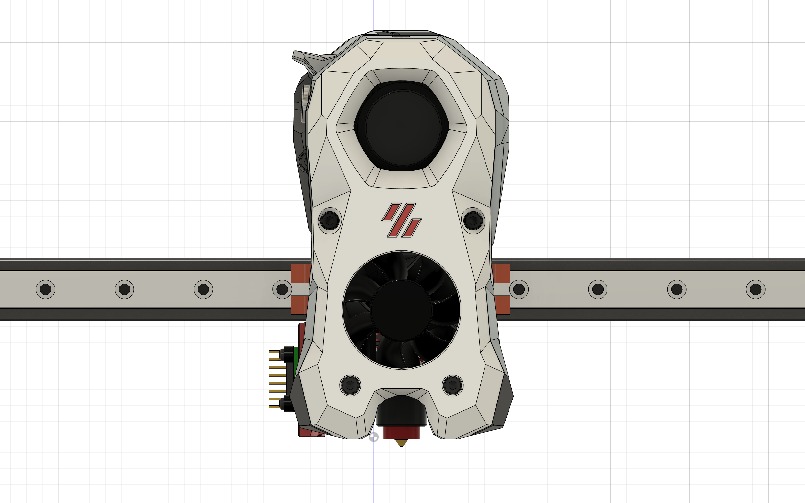
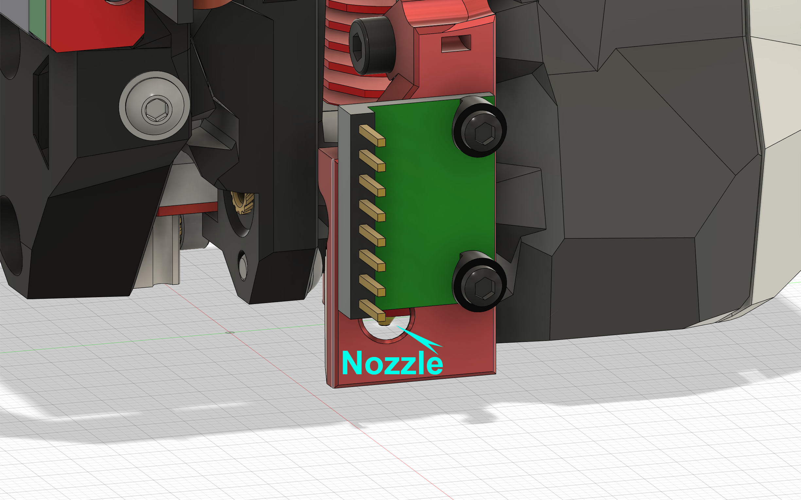
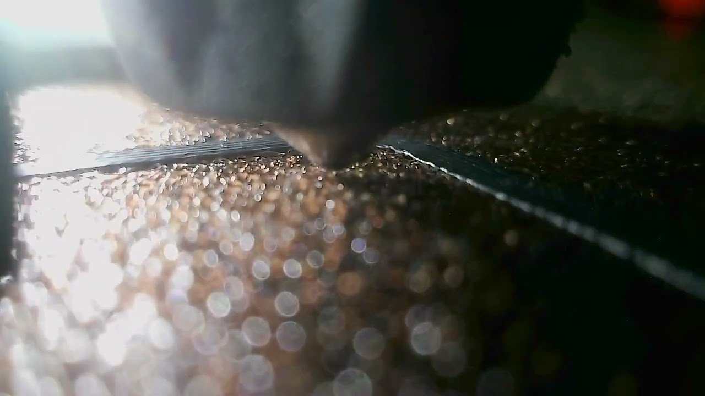

# Sony IMX258 as Nozzle Camera for the Voron Stealthburner 
This is my take of a Nozzle Camera based on the readily available and off-the-shelf Sony IMX258 Camera Sensor.

In the spirit of open source and Do-It-Yourself, I decided to also jump in on the hype and have my own take on this, especially as I am not satisfied with the current offerings out there and provide the community with more options as to where they can source their parts, hopefully for cheaper and better tailored for our printers.

The center-piece of this mod is the off-the-shelf Sony IMX258, it is capable of 4K30fps or 1080p60fps, however do take note that while the datasheet for the IMX258 shows these specs, many sellers may not have configured their driver board correctly as they focus on it's 4K capability instead of the higher frame rate that we are more focused on. These sensors come in a variety of different lense options from Auto Focus to Fixed Focus, from narrow to wide angles.

As a cheaper alternative, there is also the OMNIVISION OV5693 which is an iteration of the OV5648 but with better low light performance, it has the exact same form factor and therefore compatible with this mod. However this sensor is only capable of 1080p30fps.

As a Nozzle Camera, what we want is a Fixed Focus camera of around 75 to 90 degrees Field of View, 80 degrees seems to be a good option, however the more commonly found 75 degrees will work just fine, again, do take notice of the FPS configured, as higher FPS means less motion blur, our printers do have a habbit of going pretty fast.

I have found a seller on AliExpress who was willing to change the lens for me to 80 degrees as well as having a correctly configured driver board. I will have a link to it in the BOM table below.

## Table of Content
- [Showroom](#showroom)
- [BOM](#bom)
- [Instructions](#instructions)
- [Remix / Derivative Work Notice](#remix--derivative-work-notice)
- [Acknowledgements](#acknowledgements)
- [Changelog](#changelog)

## Showroom

Video: https://www.instagram.com/reel/CogMm3sAScI/

## BOM
Pick ONE camera sensor from below, you WILL need to buy it with the driver board. You CAN definitely buy them from elsewhere or use other sensors, these are just the ones I used and are known to work. If you opt to buy the same sensor from elsewhere, please take note of it's specs, like I mentioned previously, they could be accidentally handicapped. Ask the seller for 80 degrees Manual Focus lens if not already configured that way.

Hardware | Quantity | Link | Note
------------ | ------------- | ------------- | -------------
Sony IMX258 with Driver | Pick | [AliExpress](https://www.aliexpress.com/item/1005005178412080.html) / [Taobao](https://m.tb.cn/h.UNFOrxw?tk=EI69dhWxV7V) | 12MP 4K30fps 1080p60fps
OMNIVISION OV5693 with Driver | Pick | [AliExpress](https://www.aliexpress.com/item/1005005203882395.html) / [Taobao](https://m.tb.cn/h.UMNivgA?tk=silWdhWDLWl) | 5MP 1080p30fps (improved low light performance over OV5648)
M2x10 Self Tapping Screw | 2 | |
M3x8 SHCS | 1 | | Socket head cap screw
M3 Heatset Insert	| 2 or 3 | | (For Cable Chain Anchor Only)

These are NOT Affiliate Links.
If you find these sensors for a good price elsewhere (such as Amazon), please let me know and I will add it to this list.

## Instructions
Writing... Coming Soon...

## Remix / Derivative Work Notice
My modifications are published under the same GPL-3.0 license of the original Voron Design projects my work also derives from.
Feel free to remix and redistribute your derivative work, however it would be much appreciated if you provide credits and link back to this repository.
You can also submit a pull request or send me your remix/related work to be included as part of this repository.

## Acknowledgements
https://github.com/VoronDesign - Thank you to the VORON Design team for the printer which this mod derives.
https://github.com/3DO-EU/nozzle-camera - Thanks for the camera sensor retention model

## Changelog
